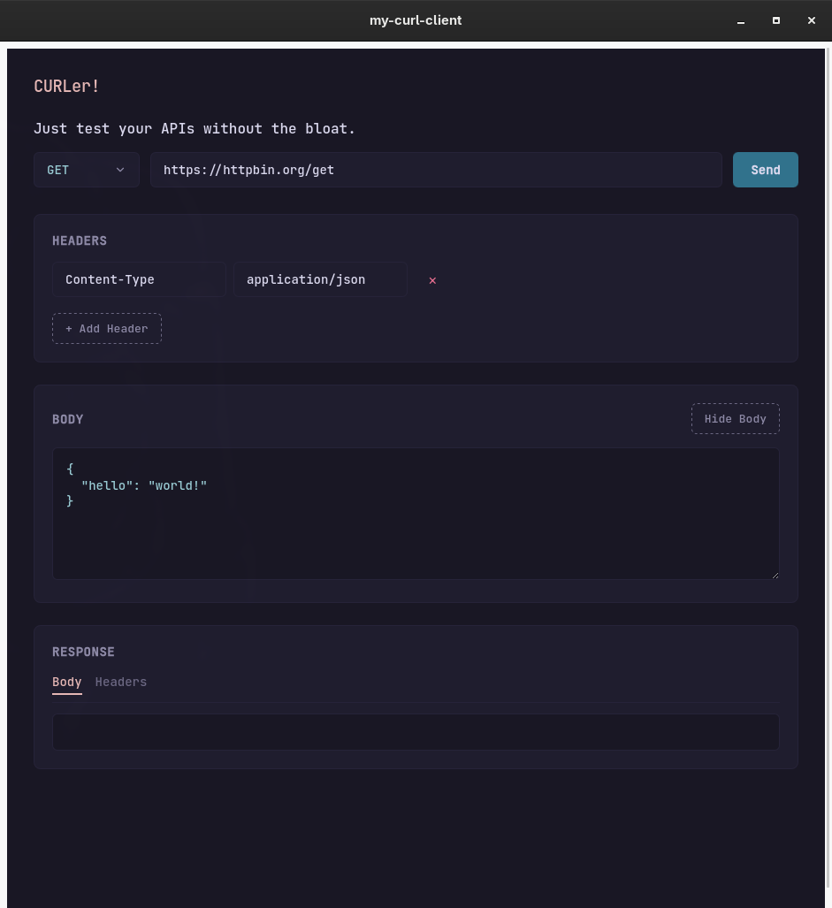

<div align="center">


# CURLer

A lightning-fast, bloat-free API client for Linux. Powered by curl, built with Tauri.


</div>

## Overview

Are you tired of launching a 500MB Electron application just to send a simple POST request? API testing shouldn't require a Chromium instance. 

This project is a minimalist, native desktop wrapper around your system's `curl` binary. It gives you the visual organization of modern API clients with the raw speed, zero-CORS freedom, and reliability of the command line.



## Features

* **Zero Bloat:** Compiles down to a tiny, native executable. No Electron, no heavy frameworks.
* **Wayland First:** Runs natively on modern Linux compositors (Hyprland, Sway) via WebKitGTK.
* **CORS? Never heard of her:** Because requests are executed at the system level via `curl`, browser security policies will never block your API calls.
* **Intelligent Parsing:** Automatically parses raw HTTP responses, extracts status codes, and pretty-prints JSON payloads.
* **Rosé Pine Aesthetic:** Carefully themed using the low-contrast, minimal Rosé Pine (Dark) color palette for late-night hacking sessions.

## How it Works

Under the hood, the Tauri (Rust) backend intercepts your UI inputs and constructs a secure `std::process::Command` array, spawning the `curl` binary already installed on your system. It captures standard output, parses the HTTP spec, and serves it back to a clean React frontend.

## Installation

Go to the releases section and download the binary.

From the downloaded directory run the below command. Make sure `.local/bin` is in your PATH.
```
mv CURLer ~/.local/bin/
```
Next create the file `CURLer.desktop` inside the directory `~/.local/share/applications` using your favorite editor and paste the below lines in there.

You can either download the `app-icon.svg` from the repo and then reference that or use your own icon.

```
[Desktop Entry]
Type=Application
Name=CURLer
Comment=Minimalist curl-powered API client
Exec=/home/yourusername/.local/bin/CURLer
Icon=/home/yourusername/path/to/your/app-icon.svg
Terminal=false
Categories=Development;Network;
```

Next run it from your app launcher! :)

## Building From Source

### Install System Dependencies
Ensure you have Rust, Node.js, and the WebKitGTK development packages installed:
````
sudo pacman -S base-devel curl rustup nodejs npm webkit2gtk-4.1
rustup default stable
````
### Clone and Build
````
git clone https://github.com/lewandowski96/CURLer.git
cd CURLer

# Install frontend dependencies
npm install

# Run in development mode
npm run tauri dev

# Or compile the final native release binary!
npm run tauri build
````
If you encounter `failed to run linuxdeploy` error during the building process run the build command again with the `NO_STRIP=true` flag at the beginning.

The compiled executable will be located in `src-tauri/target/release/`

## Contributing

Contributions are welcome! If you want to add features (like saving request history, environment variables, or auth token management) while maintaining the strict "no-bloat" philosophy, feel free to open a PR.

    1. Fork the Project
    2. Create your Feature Branch (git checkout -b feature/AmazingFeature)
    3. Commit your Changes (git commit -m 'Add some AmazingFeature')
    4. Push to the Branch (git push origin feature/AmazingFeature)
    5. Open a Pull Request

## License

Distributed under the MIT License. See LICENSE for more information.

Crafted by [KSanjnN](https://www.linkedin.com/in/ksanjeen/) for the Linux community.
